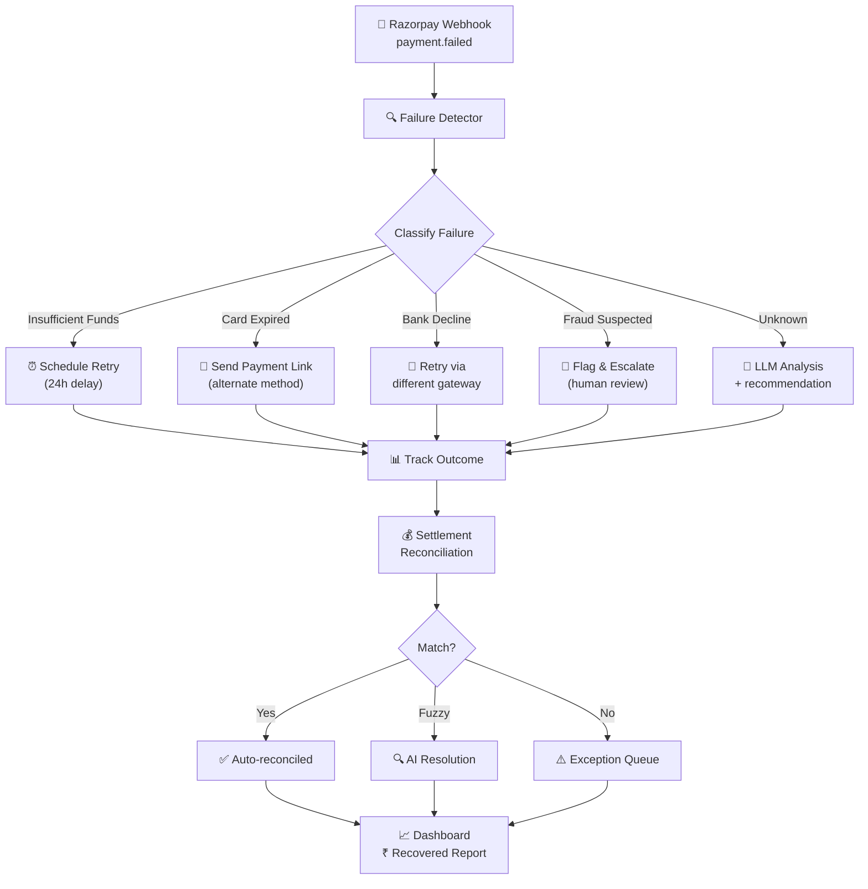

# 🏗️ Razorpay Hackathon — Master Strategy & Deep Analysis

> **Goal**: Pick the highest-impact track, build something that stands out, and ideally weave multiple tracks together for a compounding advantage.

---

## Reading Between the Lines — What Razorpay Actually Wants

Before diving into tracks, let's decode the **evaluation rubric**:

| Criteria | What They're Really Asking |
|---|---|
| **Problem taste** | Don't build a toy. Show you understand *why* this is hard in production. |
| **Build quality** | Production-grade code. Tests, error handling, clean architecture. Not a Jupyter notebook demo. |
| **AI judgment** | Don't slap GPT on everything. Show *where* AI adds value and where a simple `if` statement is better. |
| **Failure recovery** | **This is the differentiator.** Most hackathon projects ignore failure. Show retries, circuit breakers, dead-letter queues, audit trails. |

> [!IMPORTANT]
> The rubric explicitly says *"what broke, and what you did about it"*. This means they want to see you **deliberately handle failure modes**, not just the happy path. This is your biggest competitive lever.

---

## Track-by-Track Deep Dive

---

## 🟢 Track 01: AI Growth & Agentic Commerce

### The Problem
Make merchants discoverable and transactable by AI agents. Today, if an AI agent wants to buy something on behalf of a user, there's no standard protocol. The merchant's catalog isn't machine-readable, checkout requires human interaction, and payment flows assume a browser.

### Why It's Hot Right Now
- **NPCI's UAP** (Unified Agent Protocol) is live — India is building the rails for agent-to-agent commerce
- **ACP, AP2, x402** — global protocols competing for the same space
- Razorpay is already piloting in-app agent commerce

### What You Could Build

#### Option A: Agent-Readable Commerce Layer (MCP Server for Merchants)
An **MCP (Model Context Protocol) server** that wraps a merchant's Razorpay store, exposing:
- Product catalog as structured tool calls
- Price, inventory, variants as queryable APIs
- Checkout as a single atomic tool call with payment link generation
- Order status, refund requests as agent-callable actions

```
┌─────────────┐     ┌──────────────────┐     ┌─────────────┐
│  AI Buyer   │────▶│  MCP Commerce    │────▶│  Razorpay   │
│  (Claude,   │     │  Server          │     │  Test Mode  │
│   GPT, etc) │◀────│  - catalog/      │◀────│  APIs       │
└─────────────┘     │  - checkout/     │     └─────────────┘
                    │  - order-status/ │
                    │  - refund/       │
                    └──────────────────┘
```

#### Option B: Conversational In-App Checkout Agent
A WhatsApp/web chat agent that:
1. Understands natural language product queries ("show me blue sneakers under ₹2000")
2. Presents options with images
3. Handles cart, address, and payment in conversation
4. Creates Razorpay payment links and tracks completion
5. Does upsell/cross-sell based on purchase patterns

#### Option C: Campaign Orchestrator
An AI agent that:
1. Analyzes merchant's sales data
2. Identifies segments ripe for campaigns
3. Auto-generates campaign content (email/SMS)
4. Schedules and sends via Razorpay's APIs
5. Measures uplift and iterates

### Architecture for Track 01

```
┌─────────────────────────────────────────────────┐
│                   Frontend                       │
│  React/Next.js Dashboard + Chat Widget           │
├─────────────────────────────────────────────────┤
│                  API Gateway                     │
│           FastAPI / Express.js                   │
├──────────┬──────────┬───────────┬───────────────┤
│ Catalog  │ Checkout │ Campaign  │ Analytics     │
│ Service  │ Service  │ Service   │ Service       │
│ (Python) │ (Python) │ (Python)  │ (Python)      │
├──────────┴──────────┴───────────┴───────────────┤
│              LLM Orchestration Layer             │
│         LangChain/LangGraph + Tool Calling       │
├─────────────────────────────────────────────────┤
│           Razorpay Test Mode APIs                │
│   Products | Payments | Payment Links | Orders   │
├─────────────────────────────────────────────────┤
│              Data Layer                          │
│     PostgreSQL + Redis + Vector Store            │
└─────────────────────────────────────────────────┘
```

### Key Failure Modes to Handle
- Payment creation fails → retry with exponential backoff, notify merchant
- LLM hallucinates a product that doesn't exist → validate against catalog before presenting
- Double-charge prevention → idempotency keys on every payment call
- Agent tries to exceed spending limit → hard guardrails, not soft prompts

---

## 🔴 Track 02: AI Risk Manager

### The Problem
Fraud, returns abuse, and chargebacks are eating merchant margins. AI-powered fraud is making attacks more sophisticated. Build a **detector, verifier, or auto-responder** for one specific class of loss.

### Why It's Hard
- You need **real metrics** (precision, recall, F1) on a held-out test set
- False positives are expensive (blocking legitimate customers)
- Must be **strictly defense-only** — anything that could be used offensively is disqualified

### What You Could Build

#### Option A: Chargeback Evidence Auto-Responder 🏆
When a chargeback comes in:
1. Pull transaction data, delivery proof, customer interaction logs
2. AI analyzes the chargeback reason code
3. Auto-generates a compelling evidence package (representment)
4. Submits via Razorpay's dispute API
5. Tracks win/loss rates

This is **extremely practical** and merchants would pay for it today.

#### Option B: Return-Risk Scorer
Score every order at checkout time for return probability:
- Customer history (return rate, account age)
- Product category risk
- Shipping distance
- Payment method
- Time of day, device fingerprint

#### Option C: Fraud Spike Detector
Real-time anomaly detection on transaction streams:
- Sudden velocity spikes from one IP/card
- Geographic impossibility (two transactions 1000km apart in 5 minutes)
- Card testing patterns (small amounts, rapid succession)

### Architecture for Track 02

```
┌──────────────────────────────────────────────┐
│              Ingestion Pipeline               │
│   Razorpay Webhooks → Kafka/Redis Streams    │
├──────────────────────────────────────────────┤
│              Feature Engineering              │
│   - Transaction velocity                      │
│   - Customer behavior vectors                 │
│   - Device/IP clustering                      │
│   - Temporal patterns                         │
├──────────────────────────────────────────────┤
│              ML Pipeline                      │
│   - XGBoost / LightGBM (tabular)             │
│   - Isolation Forest (anomaly)               │
│   - Graph Neural Network (ring detection)    │
│   - LLM (evidence generation for disputes)   │
├──────────────────────────────────────────────┤
│              Decision Engine                  │
│   - Risk score → Action mapping              │
│   - Threshold tuning UI                       │
│   - Human-in-the-loop escalation             │
├──────────────────────────────────────────────┤
│              Evaluation                       │
│   - Precision/Recall/F1 on held-out set      │
│   - False positive cost analysis              │
│   - A/B testing framework                     │
└──────────────────────────────────────────────┘
```

### Tech Stack
- **ML**: scikit-learn, XGBoost, PyTorch (for GNNs)
- **Data**: Pandas, synthetic data generator
- **API**: FastAPI
- **Dashboard**: Streamlit or React

### Key Differentiator
Most teams will build a basic fraud classifier. **The chargeback auto-responder is unique** because:
1. It's post-fraud (defense, not prediction)
2. It directly recovers money (measurable ROI)
3. It uses LLMs where they actually shine (document generation)
4. The evaluation is clean (win rate on disputes)

---

## 🟡 Track 03: AI Revenue Recovery

### The Problem
Money leaks at every stage: payment failures, cart abandonment, subscription lapses, overdue invoices. Build an agent that **detects → diagnoses → recovers**.

### What You Could Build

#### Option A: Payment Failure Recovery Engine 🏆
```
Payment Fails → Detect Reason → Choose Recovery Strategy → Execute → Track
```

1. **Detect**: Listen to Razorpay webhooks for `payment.failed` events
2. **Diagnose**: Parse error codes — is it insufficient funds? Card expired? Bank decline?
3. **Decide**: AI picks the right recovery action:
   - Insufficient funds → retry in 24h, send reminder
   - Card expired → send payment link with alternate method
   - Bank decline → try different payment gateway
   - Repeated failure → escalate to human
4. **Execute**: Automated retry, payment link generation, SMS/email
5. **Measure**: Show ₹ recovered across a batch

#### Option B: Checkout Abandonment Recovery
1. Track abandoned carts via session analytics
2. AI determines optimal recovery timing and channel
3. Personalized recovery messages (not generic "you left items in cart")
4. Dynamic incentive calculation (minimum discount to recover)
5. Compliance-aware — stop after N attempts, respect DND

#### Option C: B2B Receivables Chaser
1. Monitor overdue invoices from Razorpay
2. AI generates personalized follow-up sequences
3. Escalation ladder: friendly reminder → firm follow-up → notice
4. Promise-to-pay tracking
5. Legal compliance (no harassment)

### Architecture for Track 03

```
┌────────────────────────────────────────────────────┐
│                  Event Ingestion                    │
│  Razorpay Webhooks → Event Queue (Redis/Kafka)     │
├────────────────────────────────────────────────────┤
│               Recovery Orchestrator                 │
│  ┌──────────┐  ┌──────────┐  ┌──────────────────┐ │
│  │ Detector │→ │ Diagnoser│→ │ Strategy Selector│ │
│  │ (Rules + │  │ (Error   │  │ (ML + Rules +    │ │
│  │  ML)     │  │  Parser) │  │  LLM reasoning)  │ │
│  └──────────┘  └──────────┘  └──────────────────┘ │
├────────────────────────────────────────────────────┤
│               Action Executors                      │
│  ┌────────┐ ┌──────────┐ ┌────────┐ ┌───────────┐ │
│  │ Retry  │ │ Payment  │ │ SMS/   │ │ Escalate  │ │
│  │ Engine │ │ Link Gen │ │ Email  │ │ to Human  │ │
│  └────────┘ └──────────┘ └────────┘ └───────────┘ │
├────────────────────────────────────────────────────┤
│               Compliance & Guardrails               │
│  - Max retry limits      - DND registry check      │
│  - Time-of-day rules     - Amount caps              │
│  - Audit trail logger    - Stop-loss triggers       │
├────────────────────────────────────────────────────┤
│               Metrics & Dashboard                   │
│  - ₹ recovered     - Recovery rate by channel       │
│  - Cost per recovery  - Time to recovery            │
└────────────────────────────────────────────────────┘
```

### Failure Modes
- Retry storm → circuit breaker pattern
- Customer harassment → hard stop after N contacts
- Payment link expires → auto-regenerate with fresh link
- Wrong diagnosis → fallback to human review

---

## 🔵 Track 04: AI Finance Controller

### The Problem
Finance operations — reconciliation, settlement verification, cash forecasting — are still done manually in spreadsheets. Build an agent that automates one finance loop across 50+ records.

### What You Could Build

#### Option A: Multi-Source Reconciliation Engine 🏆
The classic problem: you have:
- Bank statement (what money moved)
- Razorpay settlements (what Razorpay says it settled)
- Your order system (what you think you sold)

These three should match. They never do. Build an AI that:
1. Ingests all three sources
2. Applies rule-based matching first (exact amount + date)
3. Uses fuzzy matching for near-matches (off by a few rupees — fees, taxes)
4. Uses LLM reasoning for complex exceptions (split payments, partial refunds)
5. Reports: match rate, unmatched items, suggested resolutions

#### Option B: Settlement Q&A Agent
An agent that can answer questions about settlements:
- "Why was yesterday's settlement ₹15,000 less than expected?"
- "Which orders from last week haven't been settled yet?"
- "What's the average settlement delay by payment method?"

#### Option C: Forward Cash Forecaster
Predict cash position for next 7/14/30 days based on:
- Historical settlement patterns
- Upcoming subscriptions/mandates
- Seasonal trends
- Known upcoming expenses

### Architecture for Track 04

```
┌─────────────────────────────────────────────────┐
│              Data Ingestion                      │
│  CSV/API → Standardized Schema → PostgreSQL      │
├─────────────────────────────────────────────────┤
│              Matching Pipeline                   │
│  ┌─────────┐  ┌───────────┐  ┌───────────────┐ │
│  │ Exact   │→ │ Fuzzy     │→ │ LLM-Powered   │ │
│  │ Match   │  │ Match     │  │ Exception      │ │
│  │ (SQL)   │  │ (Levensh.)│  │ Resolution     │ │
│  └─────────┘  └───────────┘  └───────────────┘ │
├─────────────────────────────────────────────────┤
│              Exception Queue                     │
│  - Unresolved items for human review             │
│  - Confidence scores on AI suggestions           │
│  - Audit trail of all matching decisions         │
├─────────────────────────────────────────────────┤
│              Reporting                           │
│  - Match rate breakdown                          │
│  - Exception categories                          │
│  - Trend analysis                                │
└─────────────────────────────────────────────────┘
```

### Why This Track is Underrated
- Most hackers will flock to Track 01 (shiny agent stuff) or Track 03 (revenue recovery)
- Track 04 is **deeply practical** and shows **financial domain expertise**
- The evaluation is **objective**: match rate on 50+ records is a clear number
- It's a great showcase for "AI judgment" — knowing when to use SQL vs fuzzy matching vs LLM

---

## 🟣 Track 05: Open Track

### What You Could Build
- **Razorpay Plugin Marketplace Agent**: An AI that helps merchants discover and configure the right Razorpay integrations
- **Merchant Health Score Dashboard**: Aggregates all risk, revenue, and ops signals into one AI-powered health score
- **Compliance Copilot**: Helps merchants stay PCI-DSS, RBI compliant with automated auditing

---

## 🎯 THE MASTER STRATEGY

### The Winning Insight: Interweave Tracks 01 + 03 + 04

> [!TIP]
> Instead of building for one track, build a **unified merchant AI command center** that touches multiple tracks. This shows breadth AND depth.

### The Pitch: **"Razorpay AI Ops Agent"**

A single agentic system that acts as a merchant's AI finance operations manager:

```
┌───────────────────────────────────────────────────────────┐
│                    MERCHANT AI OPS AGENT                   │
│              "Your AI Revenue Operations Team"             │
├───────────┬───────────────┬──────────────┬────────────────┤
│  Track 01 │   Track 03    │  Track 04    │  Track 02      │
│  GROW     │   RECOVER     │  CONTROL     │  PROTECT       │
│           │               │              │                │
│ • Agent-  │ • Payment     │ • Auto-      │ • Chargeback   │
│   readable│   failure     │   reconcile  │   evidence     │
│   catalog │   recovery    │   settlements│   generator    │
│ • AI buyer│ • Smart retry │ • Exception  │ • Risk scoring │
│   checkout│ • Escalation  │   reporting  │                │
│           │   ladder      │ • Cash       │                │
│           │               │   forecast   │                │
├───────────┴───────────────┴──────────────┴────────────────┤
│                   SHARED INFRASTRUCTURE                     │
│  ┌─────────────────────────────────────────────────────┐   │
│  │ Razorpay API Layer (Test Mode)                      │   │
│  │ • Payments  • Orders  • Settlements  • Disputes     │   │
│  ├─────────────────────────────────────────────────────┤   │
│  │ Audit Trail & Compliance Engine                     │   │
│  │ • Every action logged  • Bounded actions only       │   │
│  │ • Human-in-the-loop gates  • Failure recovery       │   │
│  ├─────────────────────────────────────────────────────┤   │
│  │ LLM Orchestration (LangGraph)                       │   │
│  │ • Tool-calling agents  • State machines             │   │
│  │ • Guardrails  • Retry logic                         │   │
│  ├─────────────────────────────────────────────────────┤   │
│  │ Data Layer                                          │   │
│  │ • PostgreSQL  • Redis  • Vector Store (Qdrant)      │   │
│  └─────────────────────────────────────────────────────┘   │
└───────────────────────────────────────────────────────────┘
```

### But Wait — Should You Go Broad or Deep?

> [!WARNING]
> **The risk of going broad**: Judges might see it as "a mile wide, an inch deep." Hackathon judges love **one thing done exceptionally well** over five things done okay.

### My Recommendation: **Go Deep on Track 03 (Revenue Recovery) with Track 04 (Finance Controller) as a natural extension**

Here's why:

| Factor | Track 01 | Track 02 | Track 03 ⭐ | Track 04 | Track 05 |
|---|---|---|---|---|---|
| **Competition** | 🔴 Very High (everyone wants to build agents) | 🟡 Medium (needs ML expertise) | 🟢 Medium-Low | 🟢 Low | 🟡 Unpredictable |
| **Measurability** | 🟡 Hard to measure "growth" | 🟢 Precision/Recall | 🟢 ₹ recovered is clear | 🟢 Match rate is clear | 🟡 Varies |
| **Razorpay API fit** | 🟡 Limited catalog APIs | 🟡 Limited fraud data | 🟢 Payments, Links, Webhooks — perfect fit | 🟢 Settlements API | 🟡 Varies |
| **"AI Judgment" showcase** | 🟡 Mostly LLM wrappers | 🟢 Real ML decisions | 🟢 When to retry vs escalate vs give up | 🟢 When to use rules vs ML vs LLM | 🟡 Varies |
| **Failure handling showcase** | 🟡 Payment fails | 🟡 False positives | 🟢 Retry storms, compliance, escalation | 🟢 Unmatched records | 🟡 Varies |
| **WOW factor** | 🟢 Flashy demos | 🟡 Metrics tables | 🟢 "We recovered ₹X from Y failed payments" | 🟡 Spreadsheet matching | 🟡 Varies |

---

## 🏆 THE BUILD: Revenue Recovery + Finance Control Agent

### Product Name: **"RecoverIQ"**

### Tagline: *"Detect. Diagnose. Recover. Reconcile."*

### Core Flow



### Feature Breakdown

#### Module 1: Failure Detection & Diagnosis (Track 03 Core)
- **Webhook listener** for `payment.failed`, `payment.captured`, `order.paid`
- **Error code parser** — maps Razorpay error codes to human-readable diagnoses
- **Pattern detector** — spots systemic failures (e.g., "HDFC Bank is declining all UPI payments since 2pm")
- **Root cause analysis** using LLM reasoning over transaction context

#### Module 2: Recovery Orchestration (Track 03 Core)
- **Strategy selector** — rule-based + LLM-enhanced decision tree
- **Action executors**:
  - Retry payment (with idempotency)
  - Generate payment link (Razorpay Payment Links API)
  - Send recovery SMS/Email (templated + personalized)
  - Escalate to human (Slack/webhook notification)
- **Compliance guardrails**:
  - Max 3 retries per payment
  - No contact after 9 PM
  - DND respect
  - Amount cap per recovery cycle
- **Stopping rules**: If recovery cost > expected recovery, stop

#### Module 3: Settlement Reconciliation (Track 04 Extension)
- **Three-way matching**: Orders ↔ Payments ↔ Settlements
- **Tiered matching pipeline**: Exact → Fuzzy → LLM-assisted
- **Exception reporting**: Clearly categorized unmatched items
- **Match rate metric**: "94.2% auto-matched, 4.8% AI-resolved, 1% exceptions"

#### Module 4: Audit Trail & Dashboard
- **Every action logged**: who/what/when/why/outcome
- **Real-time dashboard** showing:
  - ₹ at risk (detected failures)
  - ₹ in recovery (active recovery workflows)
  - ₹ recovered (successful recoveries)
  - Recovery rate by channel/method
  - Reconciliation match rate
- **Failure timeline**: Visual audit trail of each recovery attempt

### Tech Stack

| Layer | Technology | Why |
|---|---|---|
| **Backend** | **Python + FastAPI** | Best ecosystem for ML + API dev |
| **Agent Framework** | **LangGraph** | State machine-based agents with tool calling, perfect for multi-step recovery workflows |
| **LLM** | **Gemini 2.5 Flash** (free tier) or **GPT-4o-mini** | Cost-effective for classification + reasoning |
| **Database** | **PostgreSQL** | Relational data (transactions, settlements) |
| **Cache/Queue** | **Redis** | Webhook event queue, rate limiting, idempotency |
| **Frontend** | **Next.js + React** | Dashboard with real-time updates |
| **Charts** | **Recharts / Tremor** | Beautiful analytics charts |
| **Synthetic Data** | **Faker + custom generators** | 50+ records with realistic failure patterns |
| **Testing** | **Pytest** | Unit + integration tests |
| **Deployment** | **Docker + Railway/Render** | Easy demo deployment |

### Microservice Architecture

```
razorpay-recoveriq/
├── services/
│   ├── webhook-receiver/          # Receives Razorpay webhooks
│   │   ├── main.py                # FastAPI app
│   │   ├── handlers.py            # Webhook event handlers
│   │   └── models.py              # Pydantic models
│   │
│   ├── failure-detector/          # Classifies and diagnoses failures
│   │   ├── classifier.py          # Error code → category mapping
│   │   ├── pattern_detector.py    # Systemic failure detection
│   │   └── root_cause.py          # LLM-powered root cause analysis
│   │
│   ├── recovery-orchestrator/     # Decides and executes recovery
│   │   ├── strategy_selector.py   # Rule engine + LLM fallback
│   │   ├── executors/
│   │   │   ├── retry.py           # Payment retry with backoff
│   │   │   ├── payment_link.py    # Razorpay Payment Link generator
│   │   │   ├── notification.py    # SMS/Email sender
│   │   │   └── escalation.py      # Human escalation
│   │   ├── guardrails.py          # Compliance checks
│   │   └── state_machine.py       # LangGraph recovery workflow
│   │
│   ├── reconciliation/            # Settlement matching
│   │   ├── ingester.py            # Multi-source data ingestion
│   │   ├── matcher.py             # Exact + fuzzy + LLM matching
│   │   └── reporter.py            # Match rate + exception report
│   │
│   └── dashboard-api/             # API for frontend
│       ├── routes.py
│       └── analytics.py
│
├── frontend/                      # Next.js dashboard
│   ├── app/
│   │   ├── dashboard/             # Main recovery dashboard
│   │   ├── audit/                 # Audit trail viewer
│   │   └── reconciliation/        # Recon results
│   └── components/
│
├── data/
│   ├── synthetic_generator.py     # Generate 50+ test records
│   └── seed_data/                 # Pre-generated test datasets
│
├── tests/
│   ├── test_classifier.py
│   ├── test_recovery.py
│   ├── test_reconciliation.py
│   └── test_guardrails.py
│
├── docker-compose.yml
├── README.md
└── AUDIT_TRAIL.md                 # Documentation of all failure handling
```

### Failure Handling (The Differentiator)

This is what will separate you from 90% of submissions:

| Failure Scenario | How We Handle It | Audit Entry |
|---|---|---|
| Razorpay API timeout | Exponential backoff (1s → 2s → 4s → 8s), max 3 retries, then dead-letter queue | `RETRY_EXHAUSTED: payment_id=pay_xyz, attempts=3, last_error=timeout` |
| Double-charge risk | Idempotency key on every payment call. Check Redis before retry. | `IDEMPOTENCY_BLOCK: payment_id=pay_xyz, existing_payment=pay_abc` |
| LLM hallucination | Validate LLM output against known error codes. Fallback to rule-based if confidence < 0.7 | `LLM_FALLBACK: confidence=0.45, used=rule_engine` |
| Retry storm | Circuit breaker: if > 5 failures in 1 min for same merchant, pause all retries | `CIRCUIT_BREAKER_OPEN: merchant_id=mrch_xyz, failures=7, cooldown=5min` |
| Customer contact limit | Hard cap: max 3 contacts per payment. No contact after 9 PM IST. | `CONTACT_LIMIT_REACHED: payment_id=pay_xyz, contacts=3, action=stop` |
| Recovery cost > value | If total recovery cost (API calls + SMS) > 20% of payment amount, stop | `COST_EXCEEDED: payment_amount=₹50, recovery_cost=₹15, action=abandon` |
| Settlement mismatch | Log exception with full context, flag for human review | `RECON_EXCEPTION: order_id=ord_xyz, expected=₹1000, settled=₹985, diff=₹15` |

### Synthetic Data Strategy

Generate 50+ records with deliberate failure patterns:

```python
# Distribution of synthetic data
FAILURE_DISTRIBUTION = {
    "insufficient_funds": 25%,     # Most common
    "card_expired": 15%,           
    "bank_decline": 20%,           
    "network_error": 10%,          
    "fraud_suspected": 5%,         
    "authentication_failed": 15%,  
    "unknown": 10%,                # Tests LLM fallback
}

RECOVERY_OUTCOMES = {
    "recovered_on_retry": 30%,
    "recovered_via_link": 25%,
    "recovered_after_notification": 15%,
    "not_recovered": 20%,
    "escalated": 10%,
}
```

### Demo Script (2-minute pitch)

1. **Show the problem**: "₹2.3L in failed payments this week for a test merchant"
2. **Show detection**: Dashboard lights up with classified failures
3. **Show recovery**: Click into one failure → see the AI's diagnosis → watch it execute recovery
4. **Show a failure being handled**: Deliberately trigger a retry storm → show circuit breaker activating
5. **Show results**: "Recovered ₹1.7L out of ₹2.3L. 74% recovery rate. Zero compliance violations."
6. **Show reconciliation**: "Of the ₹1.7L recovered, 94% auto-reconciled with settlements"
7. **Show audit trail**: Full log of every decision, every action, every failure handled

---

## ⏱️ Build Timeline (48-hour Hackathon)

| Phase | Hours | What |
|---|---|---|
| **Setup** | 0-3 | Project scaffolding, Razorpay test mode setup, Docker compose |
| **Data** | 3-5 | Synthetic data generator, seed database |
| **Core Engine** | 5-15 | Failure classifier, recovery orchestrator, guardrails |
| **Reconciliation** | 15-20 | Matching pipeline, exception reporting |
| **LLM Integration** | 20-25 | Root cause analysis, strategy selection |
| **Dashboard** | 25-35 | Frontend with real-time updates, audit trail |
| **Testing** | 35-40 | Unit tests, integration tests, failure scenarios |
| **Polish** | 40-45 | README, demo script, video recording |
| **Buffer** | 45-48 | Bug fixes, deployment |

---

## 🎪 Competitive Edge Checklist

- [ ] **Every money action is explainable** → Audit trail with reasoning
- [ ] **Every action is bounded** → Amount caps, retry limits, time windows
- [ ] **Every action is gated** → Human approval for high-value actions
- [ ] **At least one failure handled gracefully** → Circuit breaker demo
- [ ] **Measured metrics** → ₹ recovered, recovery rate, match rate
- [ ] **Honest exceptions** → Clear list of what the system couldn't resolve
- [ ] **AI used meaningfully** → LLM for diagnosis, not for simple rule matching
- [ ] **Production-quality code** → Types, tests, error handling, docs

> [!CAUTION]
> **What NOT to do**:
> - Don't build a chatbot that just wraps GPT with Razorpay docs
> - Don't show only happy-path demos
> - Don't use AI where a simple `if` statement works
> - Don't ignore compliance (DND, contact limits, time restrictions)
> - Don't fake metrics — use real numbers from your synthetic data

---

## 💡 Bonus: If You Want to Stand Out Even More

1. **Hinglish support**: Recovery messages in Hindi/Hinglish for better conversion
2. **Voice recovery**: Outbound IVR calls for high-value failed payments
3. **Razorpay MCP Server**: Expose your entire system as an MCP server that other AI agents can call
4. **Real-time Slack/Discord bot**: Merchant gets instant notifications with one-click actions

---

## Summary: What to Build

> **Product**: RecoverIQ — AI Revenue Recovery + Finance Control Agent
>
> **Primary Track**: Track 03 (Revenue Recovery)
>
> **Secondary Track**: Track 04 (Finance Controller)
>
> **Core Loop**: Detect failed payments → Diagnose root cause → Execute bounded recovery → Reconcile settlements → Report metrics
>
> **Killer Feature**: Comprehensive failure handling with full audit trail
>
> **Demo Metric**: "Recovered ₹X out of ₹Y across 50+ test transactions, with 0 compliance violations"
